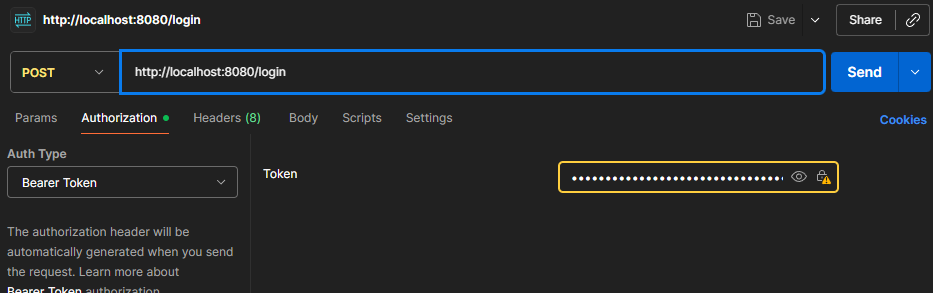

Passo 1 – Autenticação

Para iniciar, envie uma requisição POST para o endpoint /login, utilizando um dos seguintes exemplos de credenciais:

Administrador:

{
"login": "admin@gmail.com",
"senha": "123qwe!@#"
}

Usuário comum:

{
"login": "usuario@gmail.com",
"senha": "123qwe123"
}

Após o envio, será retornado um token JWT.

Passo 2 – Configuração de Autorização

No cliente HTTP (ex.: Postman ou Insomnia), acesse a aba Authorization e configure:

Auth Type: Bearer Token
Token: insira o valor do token recebido na etapa anterior.

Passo 3 – Operações com Clientes

Com o token devidamente configurado, é possível realizar operações no endpoint /clientes.

Envie o seguinte JSON no corpo da requisição para o método post:

{
"nome": "teste",
"cpf": "11111111111",
"endereco": {
"cep": "20010-000",
"logradouro": "Rua Primeiro de Março",
"bairro": "Centro",
"cidade": "Rio de Janeiro",
"uf": "RJ",
"complemento": "Sala 5"
},
"telefones": [
{
"numero": "21987654321",
"tipo": "CELULAR"
},
{
"numero": "21987654321",
"tipo": "RESIDENCIAL"
}
],
"emails": [
"teste.mendes@example.com",
"teste.mendes@example.com"
]
}

Passo 4 – Consulta de CEP

Para consultar informações de um CEP, envie uma requisição GET para:

/cep/{cep}

Exemplo:

/cep/72010900

